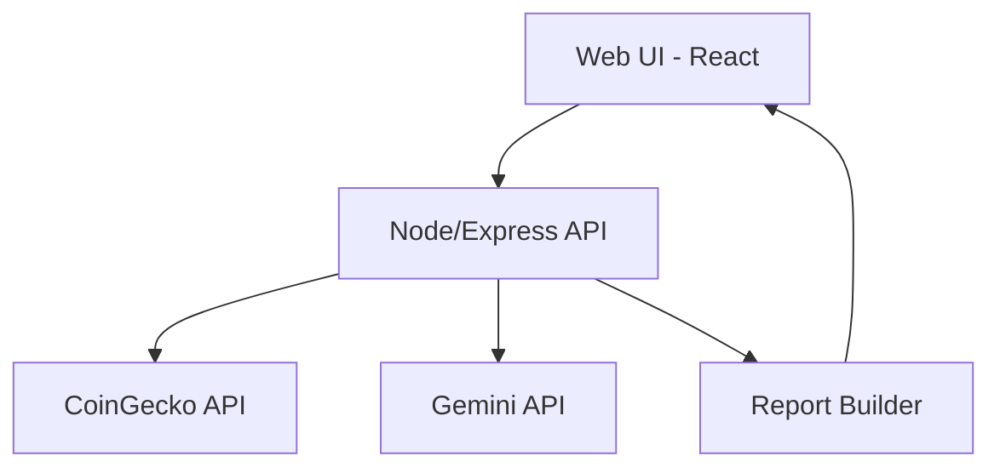

# Technical Design Document: CryptoSense MVP

## Overview

This document explains how we will build CryptoSense as a web app MVP, optimized for fast delivery, zero monthly cost, and clean architecture.

## Recommended Approach

### Best Path: Full-code, AI-first (you validate and test)

**Why this works**
- Matches your JS/React/Node comfort and avoids TypeScript overhead
- Fast iteration with AI generating code and you validating
- Keeps architecture clear for a portfolio demo
- Zero-cost stack using free tiers

**Trade-offs (honest)**
- Less safety than TypeScript (more runtime errors if not tested)
- Free tiers can throttle or change limits
- API dependency risk (CoinGecko and Gemini)

### Alternatives Compared (with pros/cons)

| Option | Pros | Cons | Cost | Time to MVP |
|--------|------|------|------|-------------|
| Full-code (React + Express) | Full control, portfolio-quality, fast to iterate with AI | More setup, more testing burden | $0 | 3-7 days |
| Low-code (templates + AI) | Fast UI scaffolding, less setup | Less control, harder to show architecture | $0 | 2-5 days |
| No-code | Fastest, minimal coding | Limited flexibility, weak for portfolio | $0 | 1-3 days |

**Recommendation justification**
Full-code is best for your goal: a clean architecture demo with AI integration. It preserves control, shows real engineering decisions, and stays within zero cost.

## Tech Stack Decision

### Frontend
- **Framework:** React (Vite)
- **Styling:** CSS modules or simple CSS (keep it minimal)
- **State:** React state + simple custom hooks
- **Testing:** Optional in MVP, focus on manual QA

**Alternatives**
- Next.js: built-in routing and API routes, but more overhead for quick MVP
- Remix: strong data flow, more learning cost

**Why React + Vite**
Fast setup, low ceremony, easy to deploy static frontend.

### Backend
- **Runtime:** Node.js
- **Framework:** Express
- **API Pattern:** REST
- **Validation:** Lightweight manual validation (no heavy libs)

**Alternatives**
- Fastify: faster, more plugins, but less familiar
- Serverless functions: simpler deploy, but more fragmentation

**Why Express**
You already know it; good for MVP speed and clarity.

### Data / Storage
- **Database:** None in V1
- **Caching:** Optional in-memory cache for API responses

**Trade-offs**
- No persistence of reports
- Limits personalization

### External Services
- **Market data:** CoinGecko API
- **LLM:** Gemini API (server-side only)

**Fallback behavior**
If Gemini fails or quota exceeded, return data-only report with a clear note.

## High-Level Architecture



### Request Flow (MVP)
1. User selects assets and level
2. Frontend calls backend `/api/report`
3. Backend fetches CoinGecko data
4. Backend compiles report sections
5. Backend calls Gemini for summary (optional)
6. Backend returns the full report JSON

## Project Structure (Proposed)

```
cryptosense/
  client/
    src/
      components/
      pages/
      services/
      styles/
      App.jsx
  server/
    src/
      routes/
      services/
      adapters/
      templates/
      app.js
  README.md
```

**Rationale**
- Clear separation between UI and API
- Easy to deploy frontend separately from backend
- Simple to understand in portfolio review

## Core Features Implementation Plan

### Feature 1: Selection of assets (1-3)
**Complexity:** Low

**Implementation**
- UI: multi-select with validation (min 1, max 3)
- Backend: validate asset list before calling APIs

**API**
- `POST /api/report` with `{ assets: ["BTC"], level: "intermediaire" }`

### Feature 2: Pedagogical level selection
**Complexity:** Low

**Implementation**
- UI: radio buttons (debutant / intermediaire / expert)
- Backend: pass level to report builder and LLM prompt

### Feature 3: Long-term structured report
**Complexity:** Medium

**Implementation**
- Backend report builder composes sections:
  - Market data
  - Fundamentals
  - Risks
  - Scenarios
  - Comparison (if >= 2)
  - Optional LLM summary

**Templates**
- Use a markdown template matching your agent output format
- Render markdown to HTML in frontend

### Feature 4: Comparison table
**Complexity:** Medium

**Implementation**
- Only build if assets.length >= 2
- Use normalized data from CoinGecko

### Feature 5: LLM summary
**Complexity:** Medium

**Implementation**
- Server-side call to Gemini
- Strict prompt rules (no financial advice)
- Fallback to data-only if API fails

## API Design (MVP)

**POST /api/report**
Request:
```json
{
  "assets": ["BTC", "ETH"],
  "level": "debutant",
  "period": "5a",
  "include": {
    "news": false,
    "charts": true,
    "compare": true,
    "llm_advisory": true
  }
}
```

Response:
```json
{
  "reportMarkdown": "...",
  "sections": {
    "market": "...",
    "fundamentals": "...",
    "risks": "...",
    "scenarios": "...",
    "comparison": "...",
    "llm": "..."
  },
  "meta": {
    "generatedAt": "2026-02-01T00:00:00Z",
    "llmUsed": true,
    "fallback": false
  }
}
```

## Security and Compliance

- No user accounts
- No PII
- API keys stored server-side only
- Strict LLM prompt constraints (no advice)
- Disclaimer rendered with report

## Performance Targets

- Full report generation: <= 15s
- Frontend load: <= 3s

**Mitigation**
- Cache CoinGecko responses for 5-15 minutes
- Keep LLM prompt short

## Deployment Plan (Zero Cost)

### Recommended
- **Frontend:** Vercel (free)
- **Backend:** Render (free) or Railway free tier

**Alternatives**
- Cloudflare Pages + Workers (free but more setup)
- Fly.io (free tier but limited)

**Trade-offs**
- Free tiers may sleep or throttle
- Cold starts can increase latency

## AI Assistance Strategy

- AI writes code in small chunks
- You validate functionality and run manual tests
- Use AI to generate prompts and guardrails for Gemini

## Risk Mitigation

| Risk | Impact | Mitigation |
|------|--------|-----------|
| CoinGecko rate limits | Medium | Cache + fallback messaging |
| Gemini quota exceeded | Medium | Auto fallback to data-only |
| LLM hallucination | High | Strict prompt + post-checks |
| Latency too high | Medium | Reduce sections or LLM usage |

## Cost Breakdown (Monthly)

| Service | Free Tier | Expected Cost |
|--------|-----------|---------------|
| Vercel (frontend) | Yes | $0 |
| Render/Railway (backend) | Yes | $0 |
| CoinGecko API | Yes | $0 |
| Gemini API | Yes (limited) | $0 |
| Total | - | $0 |

## Timeline (ASAP, short sprint)

- Day 1: Setup repo, frontend shell, backend API stub
- Day 2: CoinGecko integration + report builder
- Day 3: LLM summary + fallback + basic UI polish
- Day 4: Manual QA + deploy

## Definition of Technical Success

- App runs without crashes
- Main user flow works end-to-end
- Report generates with/without LLM
- Deployment accessible publicly
- All costs stay at $0/month

---
*Created: 2026-02-01*  
*Status: Draft for review*
